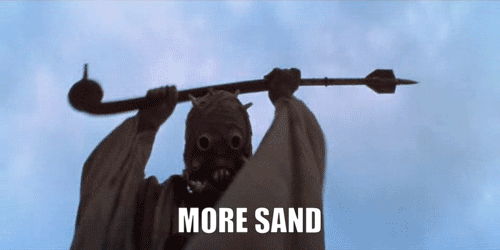

# About

This is my personal programming sandbox, where I include random code experiments and tests.

I started this because even after years of coding I have had a hard time keeping track of all the code I write because I always felt that only good clean purpuseful code deserved to be committed and added to github. So this is my way to circumvent that by keeping all the miscellaneous code that I write in one place judgement-free.

### Conventions

Despite it being a judgement-free space to just write code. I still think its good to have some standards and conventions to make it easier to read and write code here.

1. Separate experiments and tests into their own branches to keep the environments separate and prevent dependency conflicts.
2. Include a NOTES.md file for each test and experiment to synthesize the results and thoughts after.
